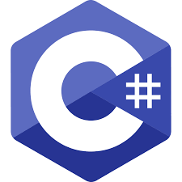
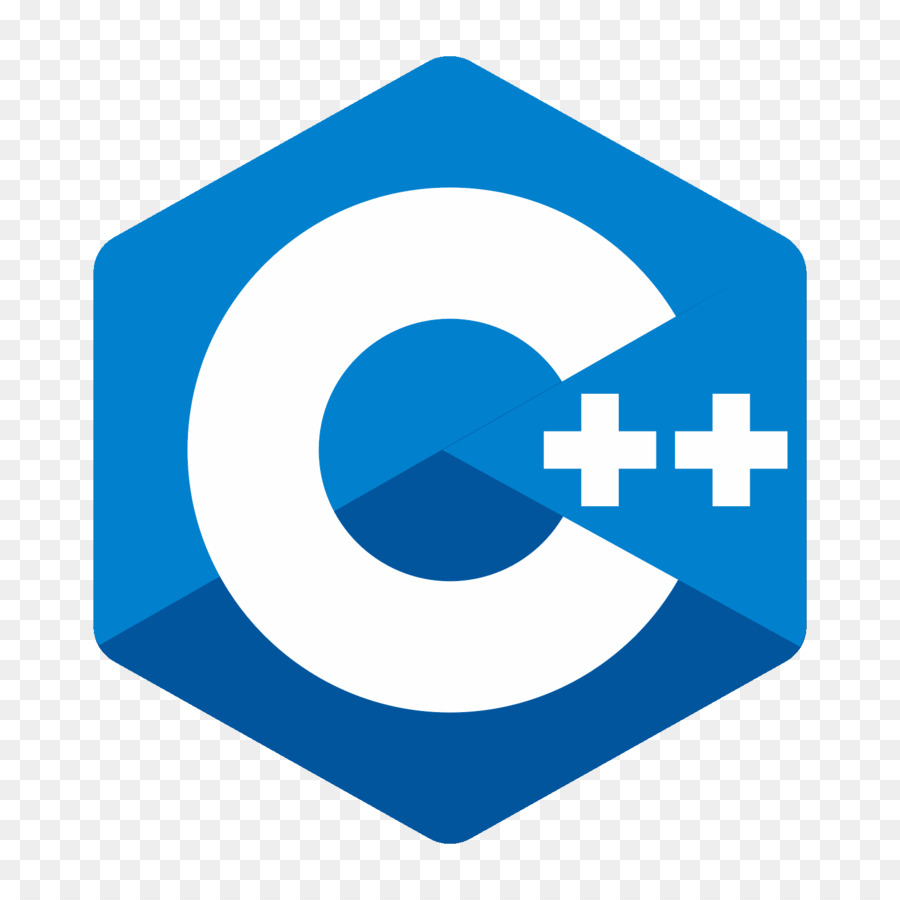

# Estudiante de Ingenieria en Tecnologia de Software💻📓

Un poco sobre mi 🙋‍♂️:

- 🔭 Soy de Tampico Tamaulipas
- 🌱 Me gusta salir a correr al menos 3 veces a la semana
- 🧑‍💻 Soy estudiande de ingennieria en tecnologia de software en la UANL
- 🤔 Actualmente trabajo en desarrollar mis habilidades de programacion y logica

Algunos lenguajes que estoy aprendiendo:

       

